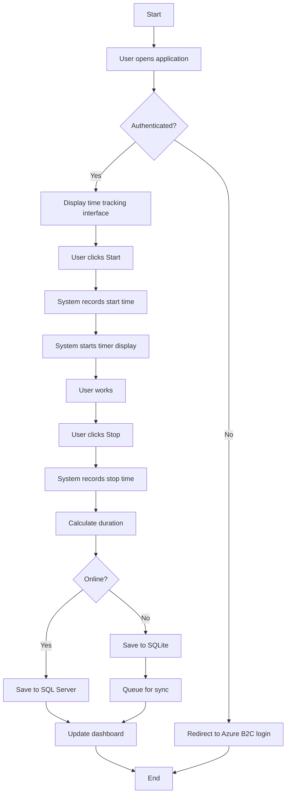
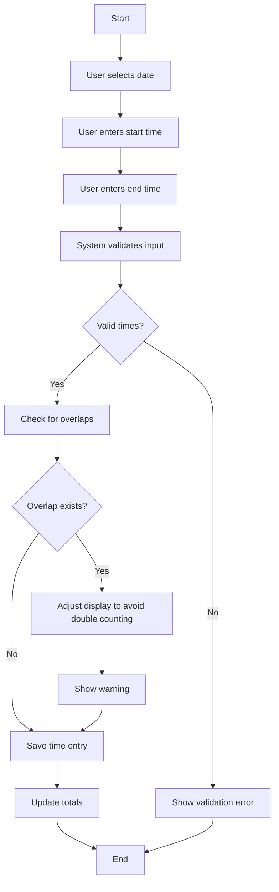
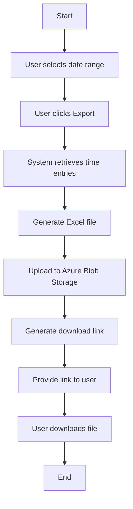

# Time Tracking System Architecture & Implementation

## Architecture Component Proposal

### System Architecture Overview

```
┌─────────────────────────────────────────────────────┐
│                   Client Layer                       │
│  ┌─────────────────────────────────────────────┐   │
│  │          Blazor WebAssembly SPA             │   │
│  │  ┌──────────────┐    ┌───────────────────┐  │   │
│  │  │ Mobile View  │    │   Desktop View    │  │   │
│  │  │  (Adaptive)  │    │   (Full Feature)  │  │   │
│  │  └──────────────┘    └───────────────────┘  │   │
│  │                                             │   │
│  │  Components:                                │   │
│  │  - Time Entry Form                          │   │
│  │  - Timer Control                            │   │
│  │  - Time Overview Dashboard                  │   │
│  │  - Export Manager                           │   │
│  │  - Offline Service Worker                   │   │
│  └─────────────────────────────────────────────┘   │
└─────────────────────────────────────────────────────┘

                          ↕ HTTPS

┌─────────────────────────────────────────────────────┐
│              Authentication Layer                    │
│           Azure AD B2C (OAuth 2.0/OIDC)             │
└─────────────────────────────────────────────────────┘

                          ↕ HTTPS

┌─────────────────────────────────────────────────────┐
│                    API Layer                         │
│            ASP.NET Core Web API                      │
│  ┌─────────────────┐    ┌─────────────────────┐    │
│  │   REST API      │    │     OData API       │    │
│  │  /api/v1/*      │    │   /odata/v1/*       │    │
│  └─────────────────┘    └─────────────────────┘    │
│                                                     │
│  Services:                                          │
│  - TimeEntryService                                 │
│  - ExportService                                    │
│  - SyncService                                      │
└─────────────────────────────────────────────────────┘

                          ↕

┌─────────────────────────────────────────────────────┐
│                  Data Layer                          │
│  ┌─────────────┐   ┌─────────────┐   ┌───────────┐  │
│  │   SQLite    │   │ SQL Server  │   │   Azure   │  │
│  │  (Offline)  │   │  (Online)   │   │   Blob    │  │
│  │            │   │             │   │  Storage  │  │
│  └─────────────┘   └─────────────┘   └───────────┘  │
└─────────────────────────────────────────────────────┘
```

### Component Details

#### 1. Client Layer (Blazor WebAssembly)
- **TimeEntryComponent**: Handles start/stop timer and manual time entry
- **DashboardComponent**: Shows weekly/monthly/yearly hours with overtime tracking
- **ExportComponent**: Manages Excel export functionality
- **OfflineService**: Manages offline data storage and synchronization
- **ResponsiveLayout**: Adapts UI between mobile and desktop views

#### 2. API Layer (ASP.NET Core)
- **REST Endpoints**: 
  - POST /api/v1/timeentries
  - GET /api/v1/timeentries
  - PUT /api/v1/timeentries/{id}
  - GET /api/v1/reports/export
  
- **OData Endpoints**:
  - GET /odata/v1/TimeEntries (with filtering, sorting, and aggregation)

#### 3. Data Layer
- **SQLite**: Client-side offline storage
- **SQL Server**: Central data storage
- **Azure Blob Storage**: Excel export file storage

## Use Case Activity Diagrams

### Use Case 1: Start/Stop Time Tracking



### Use Case 2: Manual Time Entry



### Use Case 3: Export to Excel



## Technical Implementation Details

### 1. Data Models

```csharp
public class TimeEntry
{
    public Guid Id { get; set; }
    public string UserId { get; set; }
    public DateTime StartTime { get; set; }
    public DateTime EndTime { get; set; }
    public TimeSpan Duration => EndTime - StartTime;
    public bool IsManualEntry { get; set; }
    public DateTime CreatedAt { get; set; }
    public DateTime? ModifiedAt { get; set; }
    public string? SyncStatus { get; set; } // "Pending", "Synced", "Conflict"
}

public class WeeklySummary
{
    public int Year { get; set; }
    public int Week { get; set; }
    public TimeSpan TotalHours { get; set; }
    public TimeSpan TargetHours => TimeSpan.FromHours(16);
    public TimeSpan Overtime => TotalHours - TargetHours;
}
```

### 2. Offline Storage Implementation

```csharp
// Service for offline data management
public class OfflineStorageService
{
    private readonly IJSRuntime _jsRuntime;
    
    public async Task SaveTimeEntryOffline(TimeEntry entry)
    {
        await _jsRuntime.InvokeVoidAsync("blazorIndexedDB.saveTimeEntry", entry);
    }
    
    public async Task<List<TimeEntry>> GetPendingSyncEntries()
    {
        return await _jsRuntime.InvokeAsync<List<TimeEntry>>("blazorIndexedDB.getPendingEntries");
    }
}

// JavaScript interop for IndexedDB
window.blazorIndexedDB = {
    saveTimeEntry: function(entry) {
        // IndexedDB implementation
    },
    getPendingEntries: function() {
        // Return entries with SyncStatus = "Pending"
    }
};
```

### 3. Time Entry Component

```csharp
@page "/timeentry"
@inject TimeEntryService TimeService
@inject IAuthenticationService AuthService

<div class="time-entry-container @(IsMobile ? "mobile" : "desktop")">
    @if (IsTimerRunning)
    {
        <div class="timer-display">
            <h2>@CurrentDuration.ToString(@"hh\:mm\:ss")</h2>
            <button class="btn btn-danger" @onclick="StopTimer">Stop</button>
        </div>
    }
    else
    {
        <button class="btn btn-primary" @onclick="StartTimer">Start</button>
    }
    
    <div class="manual-entry">
        <h3>Manual Entry</h3>
        <EditForm Model="@manualEntry" OnValidSubmit="@SaveManualEntry">
            <DataAnnotationsValidator />
            <div class="form-group">
                <label>Date:</label>
                <InputDate @bind-Value="manualEntry.Date" />
            </div>
            <div class="form-group">
                <label>Start Time:</label>
                <InputText @bind-Value="manualEntry.StartTime" />
            </div>
            <div class="form-group">
                <label>End Time:</label>
                <InputText @bind-Value="manualEntry.EndTime" />
            </div>
            <button type="submit" class="btn btn-primary">Save</button>
        </EditForm>
    </div>
</div>

@code {
    private bool IsTimerRunning;
    private DateTime? TimerStartTime;
    private TimeSpan CurrentDuration;
    private Timer _timer;
    
    private async Task StartTimer()
    {
        TimerStartTime = DateTime.Now;
        IsTimerRunning = true;
        _timer = new Timer(UpdateTimer, null, TimeSpan.Zero, TimeSpan.FromSeconds(1));
    }
    
    private async Task StopTimer()
    {
        var entry = new TimeEntry
        {
            StartTime = TimerStartTime.Value,
            EndTime = DateTime.Now,
            UserId = await AuthService.GetUserId(),
            IsManualEntry = false
        };
        
        await TimeService.SaveTimeEntry(entry);
        IsTimerRunning = false;
        _timer?.Dispose();
    }
}
```

### 4. Sync Service

```csharp
public class SyncService : BackgroundService
{
    private readonly IServiceProvider _serviceProvider;
    
    protected override async Task ExecuteAsync(CancellationToken stoppingToken)
    {
        while (!stoppingToken.IsCancellationRequested)
        {
            try
            {
                using var scope = _serviceProvider.CreateScope();
                var offlineService = scope.ServiceProvider.GetRequiredService<OfflineStorageService>();
                var timeService = scope.ServiceProvider.GetRequiredService<TimeEntryService>();
                
                var pendingEntries = await offlineService.GetPendingSyncEntries();
                
                foreach (var entry in pendingEntries)
                {
                    if (await IsOnline())
                    {
                        await timeService.SyncToServer(entry);
                        entry.SyncStatus = "Synced";
                        await offlineService.UpdateSyncStatus(entry);
                    }
                }
            }
            catch (Exception ex)
            {
                // Log error
            }
            
            await Task.Delay(TimeSpan.FromMinutes(5), stoppingToken);
        }
    }
}
```

### 5. Export Service

```csharp
public class ExportService
{
    private readonly TimeEntryService _timeService;
    private readonly BlobServiceClient _blobClient;
    
    public async Task<string> GenerateExcelExport(DateTime startDate, DateTime endDate, string userId)
    {
        var entries = await _timeService.GetTimeEntries(userId, startDate, endDate);
        
        using var package = new ExcelPackage();
        var worksheet = package.Workbook.Worksheets.Add("Time Entries");
        
        // Add headers
        worksheet.Cells[1, 1].Value = "Date";
        worksheet.Cells[1, 2].Value = "Start Time";
        worksheet.Cells[1, 3].Value = "End Time";
        worksheet.Cells[1, 4].Value = "Duration (Hours)";
        
        // Add data
        int row = 2;
        foreach (var entry in entries)
        {
            worksheet.Cells[row, 1].Value = entry.StartTime.ToString("dd.MM.yyyy");
            worksheet.Cells[row, 2].Value = entry.StartTime.ToString("HH:mm");
            worksheet.Cells[row, 3].Value = entry.EndTime.ToString("HH:mm");
            worksheet.Cells[row, 4].Value = entry.Duration.TotalHours;
            row++;
        }
        
        // Add summary
        worksheet.Cells[row + 1, 3].Value = "Total Hours:";
        worksheet.Cells[row + 1, 4].Formula = $"SUM(D2:D{row-1})";
        
        // Save to blob storage
        var bytes = package.GetAsByteArray();
        var blobName = $"exports/{userId}/{DateTime.Now:yyyyMMddHHmmss}.xlsx";
        
        var containerClient = _blobClient.GetBlobContainerClient("timetracking");
        var blobClient = containerClient.GetBlobClient(blobName);
        
        await blobClient.UploadAsync(new BinaryData(bytes));
        
        // Generate SAS token for download
        var sasBuilder = new BlobSasBuilder
        {
            BlobContainerName = "timetracking",
            BlobName = blobName,
            ExpiresOn = DateTimeOffset.UtcNow.AddHours(1)
        };
        sasBuilder.SetPermissions(BlobSasPermissions.Read);
        
        return blobClient.GenerateSasUri(sasBuilder).ToString();
    }
}
```

### 6. Progressive Web App Configuration

```json
// wwwroot/manifest.json
{
  "name": "Time Tracker",
  "short_name": "TimeTrack",
  "start_url": "/",
  "display": "standalone",
  "background_color": "#ffffff",
  "theme_color": "#0078d4",
  "icons": [
    {
      "src": "icon-192.png",
      "sizes": "192x192",
      "type": "image/png"
    },
    {
      "src": "icon-512.png",
      "sizes": "512x512",
      "type": "image/png"
    }
  ]
}
```

```javascript
// wwwroot/service-worker.js
self.addEventListener('install', event => {
    event.waitUntil(
        caches.open('time-tracker-v1').then(cache => {
            return cache.addAll([
                '/',
                '/index.html',
                '/css/app.css',
                '/_framework/blazor.webassembly.js',
                // Add other static assets
            ]);
        })
    );
});

self.addEventListener('fetch', event => {
    event.respondWith(
        caches.match(event.request).then(response => {
            return response || fetch(event.request);
        })
    );
});
```

### 7. Database Schema

```sql
-- SQL Server schema
CREATE TABLE TimeEntries (
    Id UNIQUEIDENTIFIER PRIMARY KEY DEFAULT NEWID(),
    UserId NVARCHAR(128) NOT NULL,
    StartTime DATETIME2 NOT NULL,
    EndTime DATETIME2 NOT NULL,
    IsManualEntry BIT NOT NULL DEFAULT 0,
    CreatedAt DATETIME2 NOT NULL DEFAULT GETUTCDATE(),
    ModifiedAt DATETIME2 NULL,
    SyncStatus NVARCHAR(20) NOT NULL DEFAULT 'Synced'
);

CREATE INDEX IX_TimeEntries_UserId ON TimeEntries(UserId);
CREATE INDEX IX_TimeEntries_StartTime ON TimeEntries(StartTime);

-- Create view for weekly summaries
CREATE VIEW WeeklySummaries AS
SELECT 
    UserId,
    YEAR(StartTime) as Year,
    DATEPART(WEEK, StartTime) as Week,
    SUM(DATEDIFF(MINUTE, StartTime, EndTime)) / 60.0 as TotalHours
FROM TimeEntries
GROUP BY UserId, YEAR(StartTime), DATEPART(WEEK, StartTime);
```

### 8. API Controllers

```csharp
[ApiController]
[Route("api/v1/[controller]")]
[Authorize]
public class TimeEntriesController : ControllerBase
{
    private readonly TimeEntryService _timeEntryService;
    
    [HttpPost]
    public async Task<ActionResult<TimeEntry>> CreateTimeEntry(TimeEntry entry)
    {
        entry.UserId = User.FindFirst(ClaimTypes.NameIdentifier)?.Value;
        var result = await _timeEntryService.CreateTimeEntry(entry);
        return CreatedAtAction(nameof(GetTimeEntry), new { id = result.Id }, result);
    }
    
    [HttpGet("{id}")]
    public async Task<ActionResult<TimeEntry>> GetTimeEntry(Guid id)
    {
        var entry = await _timeEntryService.GetTimeEntry(id);
        if (entry == null) return NotFound();
        return Ok(entry);
    }
    
    [HttpGet("summary")]
    public async Task<ActionResult<OvertimeSummary>> GetOvertimeSummary(
        [FromQuery] string period = "week") // week, month, year
    {
        var userId = User.FindFirst(ClaimTypes.NameIdentifier)?.Value;
        var summary = await _timeEntryService.GetOvertimeSummary(userId, period);
        return Ok(summary);
    }
}
```

### 9. Authentication Configuration

```csharp
// Program.cs configuration for Azure AD B2C
builder.Services.AddAuthentication(options =>
{
    options.DefaultScheme = JwtBearerDefaults.AuthenticationScheme;
})
.AddMicrosoftIdentityWebApi(options =>
{
    builder.Configuration.Bind("AzureAdB2C", options);
    options.TokenValidationParameters.NameClaimType = "name";
},
options => { builder.Configuration.Bind("AzureAdB2C", options); });

// appsettings.json
{
  "AzureAdB2C": {
    "Instance": "https://{tenant}.b2clogin.com/",
    "ClientId": "{client-id}",
    "Domain": "{tenant}.onmicrosoft.com",
    "SignUpSignInPolicyId": "B2C_1_signupsignin"
  }
}
```

## Summary

This architecture provides a robust, offline-capable time tracking solution with the following key features:

1. **Responsive Design**: Single Blazor WebAssembly application that adapts between mobile and desktop views
2. **Offline Support**: SQLite for local storage with automatic synchronization
3. **Authentication**: Azure AD B2C integration for secure access
4. **Export Functionality**: Excel export via Azure Blob Storage
5. **Overtime Tracking**: Automatic calculation of overtime hours
6. **Robust Time Handling**: Proper handling of overlapping entries and timezone issues

The solution leverages the specified tech stack effectively while maintaining simplicity and adhering to the stakeholder requirements.
